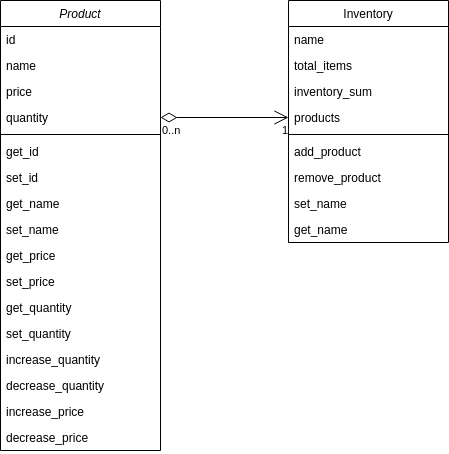

# product_inventory
Create an application which manages an inventory of products. Create a product class which has a name, price, id, and 
quantity on hand. Then create an inventory class which keeps track of various products and can sum up the inventory 
value.

## UML showing class properties, methods and relationships

## Product Class
This class is to ... 

## Inventory Class

This class is to do ... and follows the singleton design pattern
